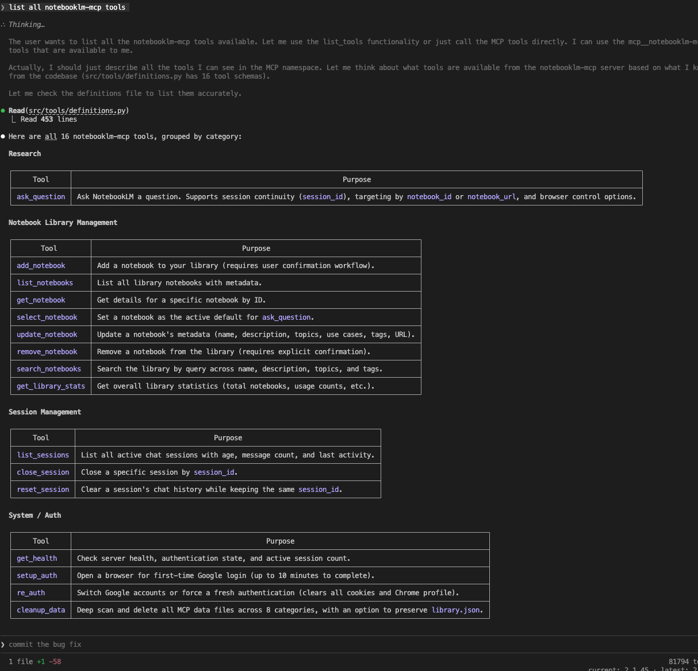
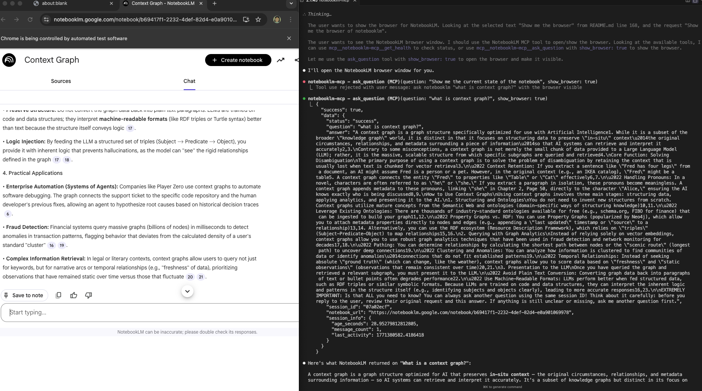

<div align="center">

# NotebookLM MCP

**Let agent harness (Claude, Cursor, Codex...) chats directly with your NotebookLM project**

Credits to [PleasePrompto](https://github.com/PleasePrompto). The original project is [NotebookLM MCP](https://github.com/PleasePrompto/notebooklm-mcp) in TypeScript. This is the Python version. 


[Installation](#installation) • [Quick Start](#quick-start) • [Why NotebookLM](#why-notebooklm-not-local-rag) • [Examples](#real-world-example)

</div>

---

## The Problem

When you tell Claude Code or Cursor to "search through my local documentation", here's what happens:
- **Massive token consumption**: Searching through documentation means reading multiple files repeatedly, which is expensive and slow.
- **Infra overhead**: You need to build a local RAG system, which is time-consuming and error-prone. 
- **Hallucinations**: When it can't find something, it invents plausible-sounding answers

## The Solution

Let your local agents chat directly with [**NotebookLM**](https://notebooklm.google/) — Google's **zero-hallucination knowledge base** powered by Gemini that provides intelligent, synthesized answers from designed documents.

```
Your Task → Claude asks NotebookLM → Gemini synthesizes answer → Claude does the rest
```

**The real advantage**: No more manual copy-paste between NotebookLM and your editor. Your agent asks NotebookLM directly and gets answers straight back in the CLI. It builds deep understanding through automatic follow-ups — Claude asks multiple questions in sequence, each building on the last, getting specific implementation details, edge cases, and best practices. You can save NotebookLM links to your local library with tags and descriptions, and Claude automatically selects the relevant notebook based on your current task. And you can use the `ask_question` tool to ask NotebookLM anything you want.


---

## Why NotebookLM, Not Local RAG?

| Approach | Token Cost | Setup Time | Hallucinations | Answer Quality |
|----------|------------|------------|----------------|----------------|
| **Feed docs to Claude** | Very high (multiple file reads) | Instant | Yes - fills gaps | Variable retrieval |
| **Web search** | Medium | Instant | High - unreliable sources | Hit or miss |
| **Local RAG** | Medium-High | Hours (embeddings, chunking) | Medium - retrieval gaps | Depends on setup |
| **NotebookLM MCP** | Minimal | 5 minutes | **Zero** - refuses if unknown | Expert synthesis |

---

## Installation

### Requirements

- Python 3.10+
- [uv](https://docs.astral.sh/uv/) package manager
- Chrome browser installed

### Setup

```bash
git clone https://github.com/wangjing0/notebooklm-mcp.git
cd notebooklm-mcp
uv sync
uv run playwright install chromium
```

### Add to Claude Code

```bash
claude mcp add notebooklm -- uv run --directory /path/to/notebooklm-mcp python main.py
```

### Add to Cursor / other MCP clients

```json
{
  "mcpServers": {
    "notebooklm": {
      "command": "uv",
      "args": ["run", "--directory", "/path/to/notebooklm-mcp", "python", "main.py"]
    }
  }
}
```

---

## Quick Start in Claude Code

### 1. Authenticate (one-time)

Say in your chat:
```
"Log me in to NotebookLM"
```
A Chrome window opens — log in with your Google account.

### 2. Create your knowledge base

Go to [notebooklm.google.com](https://notebooklm.google.com) → Create notebook → Upload your docs:
- PDFs, Google Docs, markdown files
- Websites, GitHub repos
- YouTube videos

Share: **Settings → Share → Anyone with link → Copy**

### 3. Let Claude use it

```
"I'm building with [library]. Here's my NotebookLM: [link]"
```

Claude now asks NotebookLM whatever metadata it needs, building expertise before writing code.

---

## Configuration

All settings are controlled via environment variables. $cp `.env.example` to `.env` and edit the file:

```bash
# Default notebook URL (optional)
NOTEBOOK_URL=https://notebooklm.google.com/notebook/...

# Browser behavior
HEADLESS=true          # Run Chrome headlessly (default: true)

# Session management
MAX_SESSIONS=10        # Max concurrent sessions (default: 10)
SESSION_TIMEOUT=900    # Session timeout in seconds (default: 900)

# Auto-login (optional)
AUTO_LOGIN_ENABLED=false
LOGIN_EMAIL=you@gmail.com
LOGIN_PASSWORD=yourpassword

# Tool profile
NOTEBOOKLM_PROFILE=full
```

---

## Architecture

```
Your Request → Claude/Cursor/Codex
                ↓
          notebooklm-mcp
                ↓
       Playwright + Chrome
                ↓
          NotebookLM UI
                ↓
              Gemini
                ↓
           Your Docs
```

Browswer state, chrome profiles are stored in `~/Library/Application Support/notebooklm-mcp/` (macOS) or the platform equivalent via `platformdirs`.

---

## Common Commands

| Intent | Say | Result |
|--------|-----|--------|
| Authenticate | *"Log me in to NotebookLM"* | Chrome opens for login |
| Add notebook | *"Add [notebooklm link] to library"* | Saves notebook with metadata |
| List notebooks | *"Show our notebooks"* | Lists all saved notebooks |
| Research first | *"Research this in NotebookLM before coding"* | Multi-question session |
| Select notebook | *"Use the React notebook"* | Sets active notebook |
| View browser | *"Show me the browser"* | Watch live NotebookLM chat |
| Fix auth | *"Repair NotebookLM authentication"* | Clears and re-authenticates |
| Switch account | *"Re-authenticate with different Google account"* | Changes Google account |
| Clean restart | *"Run NotebookLM cleanup"* | Removes all data for fresh start |

---

## FAQ

**Is it really zero hallucinations?**
NotebookLM is specifically designed to only answer from uploaded sources. If it doesn't know, it says so.

**What about rate limits?**
Free tier has daily query limits ~50 per Google account. Quick account switching is supported via the `re_auth` tool.

**How secure is this?**
Chrome runs locally. Your credentials never leave your machine. Use a dedicated Google account if preferred.

**Can I see what's happening?**
Yes — say *"Ask NotebookLM '[your question]' and show me the browser"* to pass `show_browser: true` to any tool call.


---

## Disclaimer

This tool automates browser interactions with NotebookLM. Google may detect automated usage. Use a dedicated Google account rather than your primary account. The browser is humanized (realistic typing speed, natural delays, mouse movements) but detection cannot be guaranteed.

Always review AI-generated code before committing. AI agents are assistants, not infallible oracles.

---

## Contributing

Found a bug? Have a feature idea? [Open an issue](https://github.com/wangjing0/notebooklm-mcp/issues) or submit a PR.

## License

MIT — Use freely in your projects.
