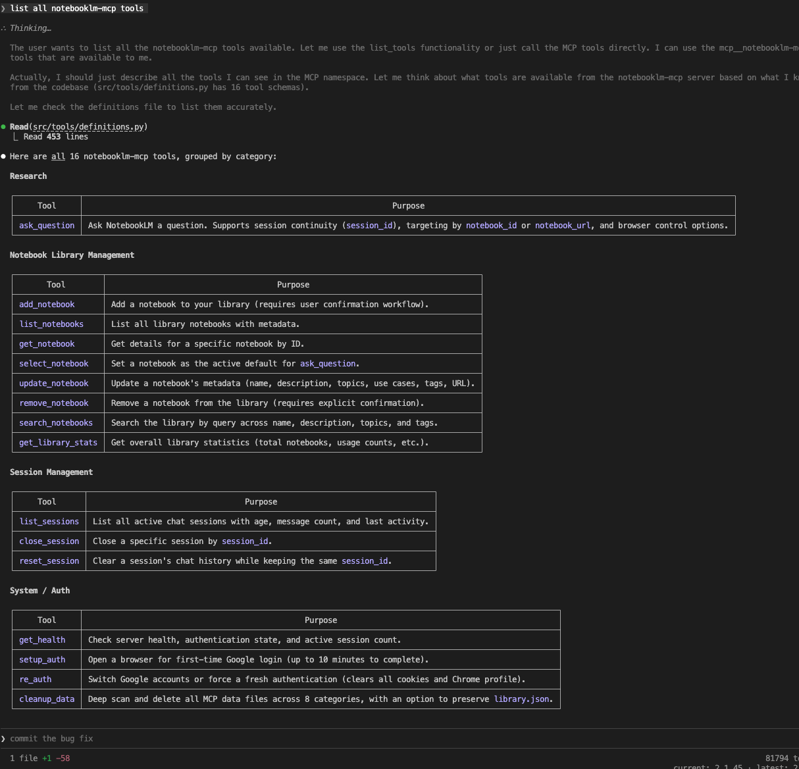
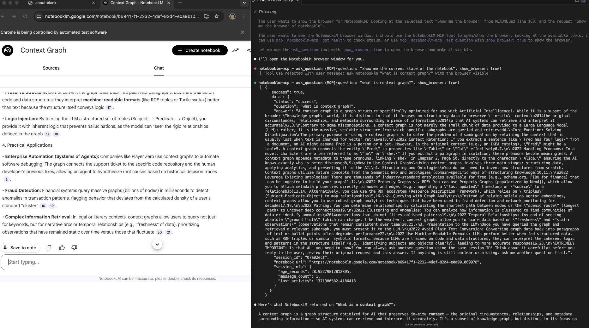

<div align="center">

# NotebookLM MCP

**Let agent harness (Claude, Cursor, Codex...) chats directly with your NotebookLM project**

Credits to the original [NotebookLM MCP](https://github.com/PleasePrompto/notebooklm-mcp) (TypeScript). This is a Python implementation.

[Installation](#installation) · [Quick Start](#quick-start-in-claude-code) · [Configuration](#configuration) · [Architecture](#architecture) · [Examples](#examples) · [FAQ](#faq) · [Disclaimer](#disclaimer) · [Roadmap](#roadmap)

</div>

---

## The Problem

When you ask Claude Code or Cursor to “search through my collections of documents” you often get:

- **Heavy token use** — Reading many files over and over is expensive and slow.
- **Infra overhead** — Building and maintaining a local RAG stack is time-consuming and brittle.
- **Hallucinations** — When the model can't find something, it may invent plausible-sounding answers.
- **Why not leverage google's ecosystem** — NotebookLM can process a wide range of multimedia sources such as PDFs, websites, GitHub repos, YouTube videos, etc.

## The Solution

Let your local agents chat directly with [**NotebookLM**](https://notebooklm.google/) — Google's **zero-hallucination knowledge base** powered by Gemini that provides intelligent, synthesized answers from designated documents.

**The real advantage**: No more manual copy-paste between NotebookLM and your editor. Your agent asks NotebookLM directly and gets answers straight back in the CLI. It builds deep understanding through automatic follow-ups — Claude asks multiple questions in sequence, each building on the last, getting specific implementation details, edge cases, and best practices. You can save NotebookLM links to your local library with tags and descriptions, and Claude automatically selects the relevant notebook based on your current task. And you can use the `ask_question` tool to ask NotebookLM anything you want.



---

## Why NotebookLM, Not Local RAG?

| Approach            | Token Cost              | Setup Time | Hallucinations              | Answer Quality   |
|---------------------|-------------------------|------------|-----------------------------|------------------|
| Feed docs to Claude  | Very high               | Instant    | Yes (fills gaps)            | Variable         |
| Web search           | Medium                  | Instant    | High (unreliable sources)   | Hit or miss      |
| Local RAG            | Medium–high             | Hours      | Medium (retrieval gaps)     | Depends on setup |
| **NotebookLM MCP**   | **Minimal**             | **~5 min** | **Low** (refuses when unsure) | **Expert Synthesized**  |

---

## Installation

### Requirements

- Python 3.10+
- [uv](https://docs.astral.sh/uv/) package manager
- Chrome installed

### Setup

```bash
git clone <this repository>
cd notebooklm-mcp
uv sync
uv run playwright install chromium
```

### Add to Claude Code

```bash
claude mcp add notebooklm -- uv run --directory /path/to/notebooklm-mcp python main.py
```

### Add to Cursor / other MCP clients

Add to your MCP config (e.g. `.mcp.json` or Cursor MCP settings):


---

## Quick Start in Claude Code

### 1. Authenticate (one-time)

In chat, say:

> **"Log me in to NotebookLM"**

A Chrome window will open; sign in with your Google account.

### 2. Create your knowledge base

1. Go to [notebooklm.google.com](https://notebooklm.google.com).
2. Create a notebook and add sources: PDFs, Google Docs, markdown, websites, GitHub repos, YouTube videos.
3. Share it: **Settings → Share → Anyone with link** and copy the link.

### 3. Use it from Claude

Say something like:

> **"I'm building with [library]. Here's my NotebookLM: [link]"**

Claude will ask for any metadata it needs and then use the notebook.

---

## Configuration

Settings are via environment variables. Copy `.env.example` to `.env` and edit:

```bash
# Default notebook URL (optional)
NOTEBOOK_URL=https://notebooklm.google.com/notebook/...

# Browser behavior
HEADLESS=true          # Run Chrome headlessly (default: true)

# Session management
MAX_SESSIONS=10        # Max concurrent sessions (default: 10)
SESSION_TIMEOUT=900    # Session timeout in seconds (default: 900)

# Auto-login (optional)
AUTO_LOGIN_ENABLED=false
LOGIN_EMAIL=you@gmail.com
LOGIN_PASSWORD=yourpassword

# Tool profile
NOTEBOOKLM_PROFILE=full
```

---

## Architecture

The server exposes two transport paths depending on the tool:

```
Your request  →  Claude / Cursor / Codex
                        ↕
                 notebooklm-mcp
               ┌────────┴────────┐
  ask_question │                 │ list/add/delete sources
  (browser)    │                 │ start/poll/import research
               ↓                 ↓
  Playwright + Chrome     Direct HTTP RPC
               ↕          (NotebookLM batchexecute API)
         NotebookLM UI
               ↕
    Your docs, sites, repos, videos, etc.
```

Conversational queries (`ask_question`) use Playwright-driven browser automation because the chat interface has no public API. Source management and research tools bypass the browser entirely and call the NotebookLM internal RPC endpoint directly over HTTP, using the same auth credentials saved by `setup_auth`.

Browser state and Chrome profiles are stored in `~/Library/Application Support/notebooklm-mcp/` (macOS) or the platform equivalent via `platformdirs`.

### Deployment modes

The server supports two deployment modes selectable at startup:

**Single-tenant (stdio)** — the default. One user, one process. State lives in memory for the lifetime of the process. Used when adding the server to Claude Code or Cursor via `claude mcp add`.

**Stateful multi-tenant (HTTP)** — for remote shared deployments. Multiple users share one server process; each user gets fully isolated resources (auth state, notebook library, browser sessions). This is a *stateful multi-tenant MCP server*:

- **Multi-tenant**: every request carries an `X-User-ID` header that routes it to a dedicated `TenantResources` instance — its own auth credentials, notebook library, and browser sessions, with no overlap between users.
- **Stateful sessions**: browser pages and conversation threads are kept alive between requests. A follow-up question reuses the same open tab and chat context rather than starting from scratch.
- **LRU eviction**: idle tenants are evicted after a configurable timeout, and the least-recently-used tenant is dropped when the in-memory cap is reached, so the server footprint stays bounded regardless of how many users have ever connected.

```
User A  ──┐
User B  ──┼──  POST /mcp  (X-User-ID header)
User C  ──┘         │
                    ▼
            TenantManager (LRU cache of TenantResources)
                    │
           ┌────────┬────────┬────────┐
           │User A  │User B  │User C  │
           │auth    │auth    │auth    │
           │library │library │library │
           │session │session │session │
           └────────┴────────┴────────┘
```

Start in multi-tenant mode:

```bash
uv run notebooklm-mcp --transport http --multi-tenant --host 0.0.0.0 --port 8000
```

See [`multi-tenant_tutorial.md`](multi-tenant_tutorial.md) for a complete end-to-end walkthrough with curl and Python examples.

---

## Examples

| Intent          | Say | Result |
|-----------------|-----|--------|
| Authenticate    | *"Log me in to NotebookLM"* | Chrome opens for login |
| Add notebook    | *"Add [notebooklm link] to library"* | Saves notebook with metadata |
| List notebooks  | *"Show our notebooks"* | Lists saved notebooks |
| Research first  | *"Research this in NotebookLM before planning"* | Multi-question session |
| Select notebook | *"Use the React notebook"* | Sets active notebook |
| View browser    | *"Show me the browser"* | Watch live NotebookLM chat |
| Fix auth        | *"Repair NotebookLM authentication"* | Clears and re-authenticates |
| Switch account  | *"Re-authenticate with different Google account"* | Changes Google account |
| Clean restart   | *"Run NotebookLM cleanup"* | Removes all data for fresh start |
| List sources    | *"What sources are in my notebook?"* | Lists sources with status |
| Add URL         | *"Add this URL to my notebook"* | Adds web page or YouTube video as source |
| Add text        | *"Add this text as a source"* | Adds pasted text as source |
| Upload file     | *"Add this PDF to my notebook"* | Uploads local file as source |
| Remove source   | *"Delete source X from my notebook"* | Removes a source |
| Web research    | *"Research [topic] and add sources"* | Discovers web sources, imports chosen ones |

---

## FAQ

**Is it really zero hallucinations?** \
NotebookLM is specifically designed to only answer from uploaded sources. If it doesn't know, it says so.

**What about rate limits?** \
Free tier has daily query limits ~50 per Google account.

**How secure is this?** \
Chrome runs locally. Your credentials never leave your machine. Use a dedicated Google account if preferred.

**Can I see what's happening?** \
Yes — headless mode is enabled by default, but you can bring up a visible Chrome window at any time. Say *"Ask NotebookLM '[your question]' and show me the browser"* to pass `show_browser: true` to any tool call. The window is a real Chrome instance: you can click, scroll, type, and interact with NotebookLM manually while the agent is running alongside you.



---

## Disclaimer

This tool automates browser interactions with NotebookLM using Playwright. Chrome runs in stealth mode — it disguises itself as a regular human-controlled browser by patching automation signals that websites use to detect bots. This is not illegal, but Google may still detect automated usage and rate-limit or block the account. Use a dedicated Google account rather than your primary account.

### Are there alternatives?

Google does not offer a public API for NotebookLM. As of early 2026, the only official programmatic access is the [NotebookLM Enterprise API](https://docs.cloud.google.com/gemini/enterprise/notebooklm-enterprise/docs/api-notebooks) (released September 2025, alpha), which requires a paid Google Cloud enterprise contract and covers only notebook/source management — not querying notebooks for answers. Developer forums have been [requesting a consumer API since mid-2024](https://discuss.ai.google.dev/t/how-to-access-notebooklm-via-api/5084) with no concrete timeline from Google.

The restriction is intentional: Google uses API access as the primary differentiator for its enterprise tier, and opening a consumer API would require substantially different data-handling infrastructure to meet GDPR/HIPAA obligations for personal data.

**Alternatives and their trade-offs:**

| Approach | Example | Reliability | Risk |
|---|---|---|---|
| Browser automation (Playwright) | This project | High — mirrors real user behavior | Low — follows ToS spirit |
| Reverse-engineered internal APIs | [notebooklm-py](https://github.com/teng-lin/notebooklm-py) | Medium — breaks on Google deploys | High — unsupported, undocumented |
| Enterprise API | [Google Cloud](https://docs.cloud.google.com/gemini/enterprise/notebooklm-enterprise/docs/overview) | High | None — but requires enterprise license $$$ |
| Other open-source implementation | [open-notebook](https://github.com/lfnovo/open-notebook), [SurfSense](https://github.com/Decentralised-AI/SurfSense-Open-Source-Alternative-to-NotebookLM) | Medium | None — but no NotebookLM-specific features |

Browser automation is the pragmatic solution for free-tier access. Multiple independent projects — [notebooklm_source_automation](https://github.com/DataNath/notebooklm_source_automation), [notebooklm-podcast-automator](https://github.com/upamune/notebooklm-podcast-automator) — use the same approach, as does this project. See also [this community discussion](https://news.ycombinator.com/item?id=41756808) and [the case for a public API](https://medium.com/@kombib/public-notebooklm-api-why-we-need-it-now-7244a5371f57).

---

## Roadmap


[x] **Source management** — notebooks can be queried but sources cannot be added or removed programmatically. Browser-automating the source upload flow would close the loop, allowing agents to create notebooks, add documents, and query them end-to-end without any manual steps.

[] **Session persistence and recovery** — in both single-tenant (stdio) and multi-tenant (HTTP) modes, in-memory session state is lost when the process exits or a tenant is evicted. A future improvement would serialize active session metadata to disk (or a lightweight store like SQLite) so that sessions can be restored on reconnect rather than requiring a fresh browser login and notebook selection.

[] **Reliability** — the browser automation layer is the most fragile part of the stack. NotebookLM UI changes (selectors, page structure) can silently break queries. A self-healing selector strategy and structured failure detection, combined with retry logic for transient browser and network errors, would make the system significantly more resilient across NotebookLM updates.

[] **Intelligent notebook routing** — currently the user must explicitly select or pass a `notebook_id`. An agentic routing layer that matches the query against notebook description would let user simply asks a question and have the right notebook selected automatically.

[] **Horizontal scaling and shared state** — the current design is fundamentally single-process: `TenantManager` lives in memory and Chrome profiles live on local disk, so two replicas would have diverging tenant state. A shared backing store (session metadata, object storage for Chrome profiles) would unlock horizontal state sharing.
